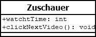
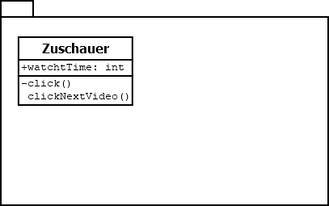
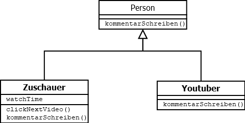
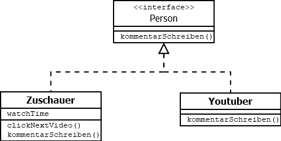

# Lerndokumentation [UML Tutorial]
1. Einleitung 
2. Klassendiagrammen Intro
3. Vererbung
## Einleitung [UML Tutorial]
Die Unified Modelling Language (UML) ist eine standardisitere Sprache für Diagramme die im Software Design genutzt werden.  

Um diese Diagramme abbilden zu können gibt es Programme wie Visio von Microsoft (Windows) oder Dia (Windows/Linux).

  

Dies ist ein Klassendiagramm, welches nun in jeder beliegigen Programmiersprache umgesetzt werden kann.  
## Klassendiagrammen Intro [UML Tutorial]
Zum entwerfen von Code gibt es Klassendiagramme, die meistens zu Packages geordnet werden.  
  

Je nach Wissenstand der Programmierer und Zusammenstellung der Klasse, kann man hier auch die Zugriffsmodifizierer und Rückgabewerte weg lassen.  

Zu den Mengen der Klassen kann man sagen, dass 100-1000 Klassen noch nicht viel für ein Projekt sind, hier sollte man aber wirklich die Packages nutzen, damit es übersichtlich bleibt.  
## Vererbung [UML Tutorial]
Die Vererbung wir bei Klassendiagrammen mit einem Pfeil mit einer durchgezogenen Linie dargestellt.  

Bei Interfaces spricht man von einer Realisierung und nutzt einen Pfeil der mit einer gestrichelten Linie dargestellt wird.  

