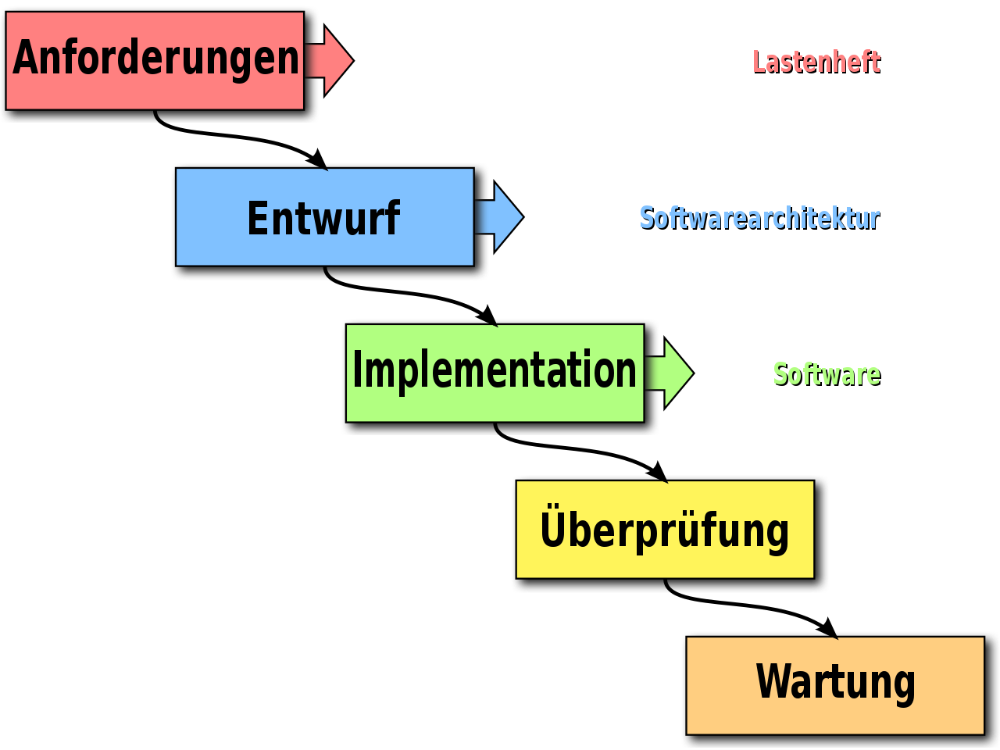

# Lerntagebuch 25.08.2022
1. Das Wasserfallmodell
## Das Wasserfallmodell [Programmieren Lernen - Lerne alle Sprachen in einer Serie]
  

Das Wasserfallmodell ist ein Modell zur Erstellung von Software und wird h‰ufig als Grundlage von andere Modellen genutzt. Dieses eignet sich aber nur schlecht zur Nutzung in realen Projekten, da Software meifltens nicht nach einem durchlauf beendet ist.  