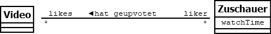

# Lerntagebuch 02.09.2022
Heute habe ich etwas zu den folgenden Themen gelernt:
1. Assoziationen
## Assoziationen [UML Tutorial]
Mit Assoziationen werden Abhängigkeiten zwischen Klassen dargestellt. 

Hierbei wird die Rolle(likes/liker) und die Multiplizität(*/*) von der jeweiligen Klasse ausgesehen dargestellt.