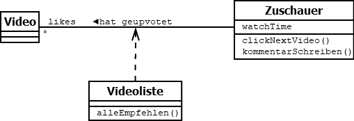

# Lerntagebuch 03.09.2022
Heute habe ich etwas zu den folgenden Themen gelernt:
1. Assoziationsklassen
## 1. Assoziationsklassen [UML Tutorial]
Bei Assoziationsklassen wird eine Klasse einer Abhängigkeit zwischen zwei Klassen zugeordnet und dargestellt.  
