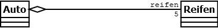

# Lerntagebuch 04.09.2022
Heute habe ich etwas zu den folgenden Themen gelernt:
1. Aggregationen
## Aggregationen [UML Tutorial]
Mit Aggregationen wird kann man ein Klasse darstellen die eine andere Klasse enthält.  
