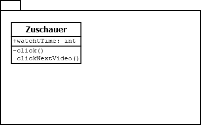

# Lerntagebuch 31.08.2022
Heute habe ich etwas zu den folgenden Themen gelernt:
1. Klassendiagrammen Intro
## Klassendiagrammen Intro [UML Tutorial]
Zum entwerfen von Code gibt es Klassendiagramme, die meistens zu Packages geordnet werden.  
  

Je nach Wissenstand der Programmierer und Zusammenstellung der Klasse, kann man hier auch die Zugriffsmodifizierer und Rückgabewerte weg lassen.  

Zu den Mengen der Klassen kann man sagen, dass 100-1000 Klassen noch nicht viel für ein Projekt sind, hier sollte man aber wirklich die Packages nutzen, damit es übersichtlich bleibt.  